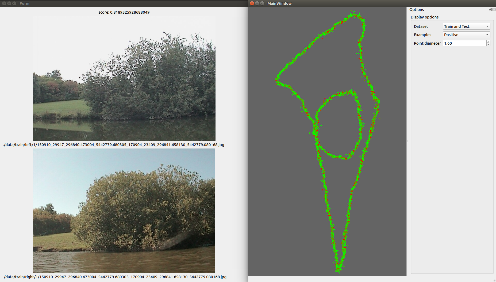

# Evaluator

A GUI tool to help visualising the results of VGGsiamese.

## Requirement

 - Python >= 3.6
 - [keras](keras.io) (only tested with TensorFlow backend)
 - PyQt5
 - numpy
 - opencv (cv2)

(Also use standard lib such as `os`, `glob` and `pickle`)

## How to run ?

To launch the GUI you only need to execute the `evaluator/main.py` script.
The interface may take some seconds to show up, as it first load keras backend.

Once everything as started, you can ether:
 
 - Evaluate a trained model, by choosing the dataset you want in `file->Select dataset`
 and then going to `file->Open siamese model`. The evaluation of the model will
 then start, this process will probably take some times (1 or 2 hours).
 
 - Load precomputed results by going to `file->Open results`.
 
You will then have a map displaying the different image position according to
the boat GPS position with a color going from green to red. Green mean that the
network was right, and red that it was wrong.

You can chose witch of the images are displayed using the setting area on the
right.

If you click on a point the corresponding pair will be displayed on another
window.

